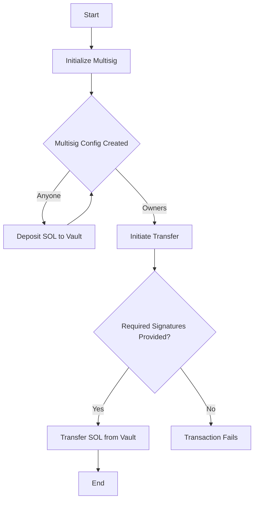

# Anchor Multisig Wallet

A simple and secure multisig wallet on Solana built with the Anchor framework.

## Features

- **Customizable Threshold**: Set the required number of signatures for transactions.
- **Owner Management**: Multiple owners can manage the wallet.
- **Secure Vault**: Funds are stored in a Program Derived Address (PDA) vault.
- **Single-Transaction Execution**: Transfer funds by providing all required signatures in one call.

## User Flow



## Getting Started

### Prerequisites

- Rust & Cargo
- Solana CLI
- Anchor CLI

### Installation

```bash
git clone https://github.com/rohitdevsol/anchor-multisig.git
cd anchor-multisig
anchor build
```

### Testing

```bash
anchor test
```

## Program Instructions

- `initialize(threshold, owners)`: Create the multisig configuration.
- `deposit(amount)`: Deposit SOL into the vault.
- `transfer_ix(amount, recipient)`: Transfer SOL (requires threshold signatures).
